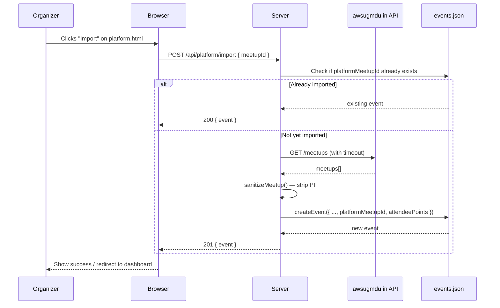
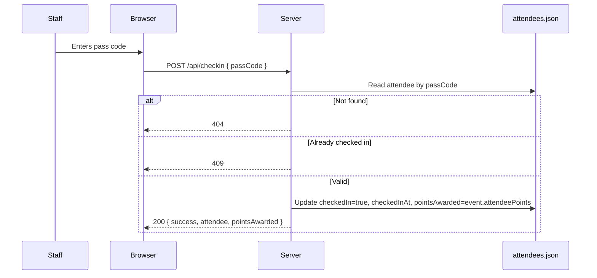

# Design — awsugmdu.in Platform Integration

## Architecture Overview

MeetupPass extends its existing single-process Node.js server with a platform integration layer. A new module `src/platform.js` encapsulates all communication with the awsugmdu.in API and owns the PII sanitization boundary. The MCP server `mcp/awsugmdu-mcp-server.js` runs as a separate process, talking over stdio JSON-RPC 2.0, and reuses `src/platform.js` to guarantee sanitization.

```mermaid
graph TD
    Browser -->|static files| Server
    Browser -->|/api/*| Server
    KiroAgent -->|stdio JSON-RPC| MCPServer[mcp/awsugmdu-mcp-server.js]
    Server --> Router[Route Dispatcher\nsrc/routes.js]
    MCPServer --> Platform[src/platform.js\nsanitizeMeetup()]
    Router --> Platform
    Platform -->|fetch + timeout| PlatformAPI[(awsugmdu.in\nPublic API)]
    Platform --> DB[src/db.js]
    Router --> DB
    DB --> EventsFile[(data/events.json)]
    DB --> AttendeesFile[(data/attendees.json)]
```

## PII Sanitization Boundary

All data flowing from the platform API passes through `sanitizeMeetup()` in `src/platform.js` before leaving that module. This is the single enforcement point for the privacy rule.

**Allow-list (only these fields survive sanitization):**
```
id, title, date, time, duration, type, status,
maxAttendees, attendees, image, meetupUrl,
hostPoints, speakerPoints, volunteerPoints
```

**Blocked fields (examples of what is stripped):**
`email`, `phone`, `userId`, `registeredUsers`, `attendedUsers`,
`hosts`, `speakers`, `volunteers`, and any other field not on the allow-list.

## Updated Data Model

### Event (extended)
```json
{
  "id": "evt_abc123",
  "name": "AWS User Group Madurai – October Meetup 2026",
  "date": "2026-10-15",
  "venue": "TIDEL Park, Madurai",
  "capacity": 60,
  "createdAt": "2026-10-01T10:00:00.000Z",
  "platformMeetupId": "mtg_001",
  "type": "circles",
  "image": "https://example.com/poster.jpg",
  "meetupUrl": "https://www.awsugmdu.in/meetups/mtg_001",
  "attendeePoints": 10
}
```

### Attendee (extended)
```json
{
  "id": "att_xyz789",
  "eventId": "evt_abc123",
  "name": "Arun Kumar",
  "email": "arun@example.com",
  "passCode": "P3K9WXMQ",
  "rsvpAt": "2026-10-10T14:22:00.000Z",
  "checkedIn": true,
  "checkedInAt": "2026-10-15T09:35:00.000Z",
  "pointsAwarded": 10
}
```

## API Reference (new endpoints)

| Method | Path | Description | Request Body | Response |
|--------|------|-------------|--------------|----------|
| GET | `/api/platform/meetups` | List sanitized platform meetups | — | `SanitizedMeetup[]` 200 / 502 |
| GET | `/api/platform/stats` | Platform member/meetup stats | — | `Stats` 200 / 502 |
| POST | `/api/platform/import` | Import platform meetup as local event | `{ meetupId, attendeePoints? }` | `Event` 201/200/404 |
| GET | `/api/leaderboard/:eventId` | Attendee leaderboard by points | — | `LeaderboardEntry[]` 200/404 |
| GET | `/api/platform/sync/:eventId` | Sync export for platform admin | — | `SyncPayload` 200/404 |

### Updated dashboard response

`GET /api/dashboard/:eventId` adds `totalPointsAwarded`:
```json
{
  "event": { ... },
  "totalRsvp": 22,
  "totalCheckedIn": 8,
  "remaining": 52,
  "recentCheckIns": [...],
  "totalPointsAwarded": 80
}
```

## Request / Response Flow — Platform Import



## Request / Response Flow — Check-In with Points



## MCP Server Architecture

`mcp/awsugmdu-mcp-server.js` is a zero-dependency stdio process implementing JSON-RPC 2.0:

```
stdin  → newline-delimited JSON-RPC request
stdout ← newline-delimited JSON-RPC response
stderr ← debug logs only (not valid JSON-RPC)
```

Tools exposed:

| Tool | Input schema | Description |
|------|-------------|-------------|
| `list_platform_meetups` | `{ status?: string, type?: string }` | Sanitized meetup list with optional filter |
| `get_platform_meetup` | `{ id: string }` | Single sanitized meetup by ID |
| `get_platform_stats` | `{}` | Platform statistics |

## Correctness Properties

These properties are verified by property-based tests in `test/platform.test.js` using **fast-check** (`numRuns >= 100`).

### Property 7: Sanitizer allow-list completeness
*For any arbitrary JavaScript object (including deeply nested structures, arrays, and unusual key names), `sanitizeMeetup(obj)` returns an object whose keys are a subset of the allow-list `{ id, title, date, time, duration, type, status, maxAttendees, attendees, image, meetupUrl, hostPoints, speakerPoints, volunteerPoints }`.*

*No key outside this set is ever present in the output.*

**Validates:** US-6.1 (PII sanitization), AC-6.1.2.

### Property 8: Points invariant
*For any combination of RSVPs and check-ins against an event with `attendeePoints = N`, the following always hold:*
- *`totalPointsAwarded = totalCheckedIn × N`*
- *`totalPointsAwarded = sum(attendee.pointsAwarded for attendee where checkedIn = true)`*
- *Every checked-in attendee has `pointsAwarded = N`.*
- *Every not-yet-checked-in attendee has `pointsAwarded = null`.*

**Validates:** US-2.1 (points on check-in), AC-2.1.1–AC-2.1.3.

### Property 9: Import idempotency
*For any `meetupId`, calling `POST /api/platform/import` twice always returns the same event `id` and never creates a second event with the same `platformMeetupId`.*

**Validates:** US-1.3 (import without duplication), AC-1.3.4.
