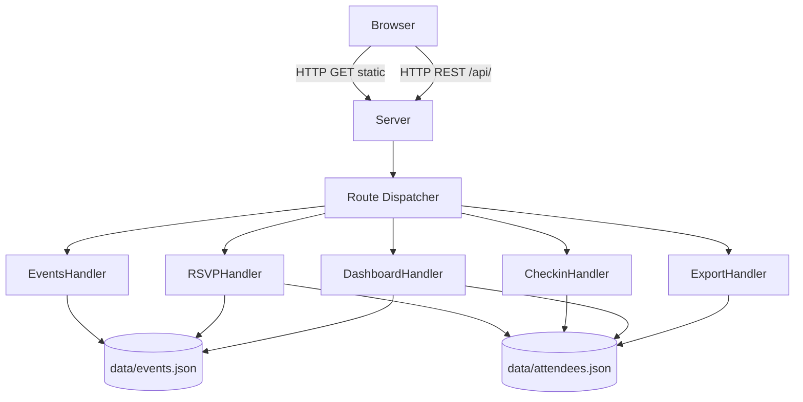
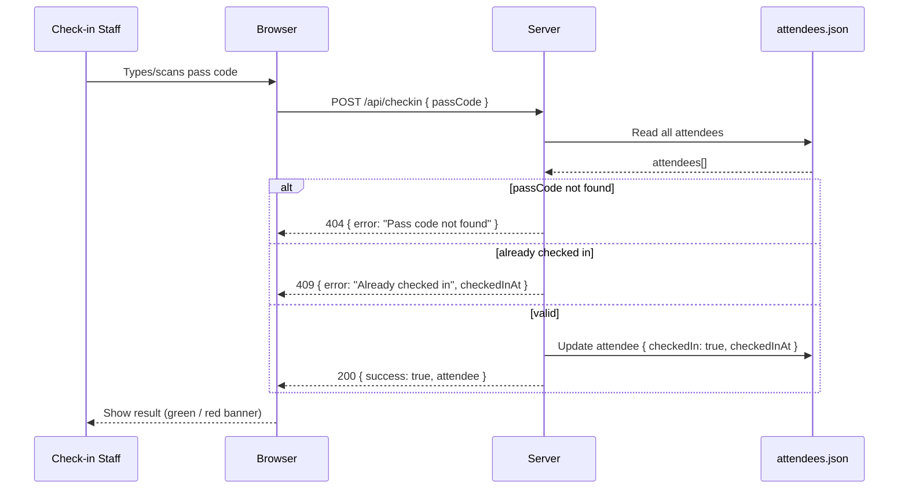

# Design — MeetupPass

## Architecture Overview

MeetupPass is a single-process Node.js HTTP server. The frontend is served as static files from `./public/`. All API routes are prefixed with `/api/`. Data is persisted to JSON files in `./data/`.



## Data Model

### Event
```json
{
  "id": "evt_abc123",
  "name": "AWS User Group Madurai – August Meetup",
  "date": "2026-08-15",
  "venue": "TIDEL Park, Madurai",
  "capacity": 60,
  "createdAt": "2026-08-01T10:00:00.000Z"
}
```

### Attendee
```json
{
  "id": "att_xyz789",
  "eventId": "evt_abc123",
  "name": "Arun Kumar",
  "email": "arun@example.com",
  "passCode": "P3K9WXMQ",
  "rsvpAt": "2026-08-10T14:22:00.000Z",
  "checkedIn": false,
  "checkedInAt": null
}
```

## API Reference

| Method | Path | Description | Request Body | Response |
|--------|------|-------------|--------------|----------|
| GET | `/api/events` | List all events | — | `Event[]` |
| POST | `/api/events` | Create event | `{ name, date, venue, capacity }` | `Event` (201) |
| GET | `/api/events/:id` | Get single event | — | `Event` |
| POST | `/api/rsvp` | RSVP for event | `{ eventId, name, email }` | `{ passCode, attendeeId }` (201) |
| POST | `/api/checkin` | Check in attendee | `{ passCode }` | `{ success, attendee }` (200) |
| GET | `/api/dashboard/:eventId` | Dashboard stats | — | `{ event, totalRsvp, totalCheckedIn, remaining, recentCheckIns }` |
| GET | `/api/export/:eventId` | Export CSV | — | CSV file |

## Pass Code Generation

Pass codes are generated using `crypto.randomBytes(6)` converted to base36 and uppercased, then truncated/padded to 8 characters. Collision probability at 60 attendees is negligible (36^8 ≈ 2.8 trillion combinations).

```js
import { randomBytes } from 'node:crypto';
function generatePassCode() {
  return randomBytes(6).toString('base64url').toUpperCase().slice(0, 8);
}
```

## Request / Response Flow — Check-In



## Static File Serving

The server maps URL paths to `./public/` files. A MIME type table maps extensions to `Content-Type` headers. If a file is not found, it returns 404. No directory listing.

## Error Handling

All API errors return JSON: `{ error: "<message>" }`. The server never crashes on a malformed request — all route handlers are wrapped in try/catch, and unhandled errors return HTTP 500.
