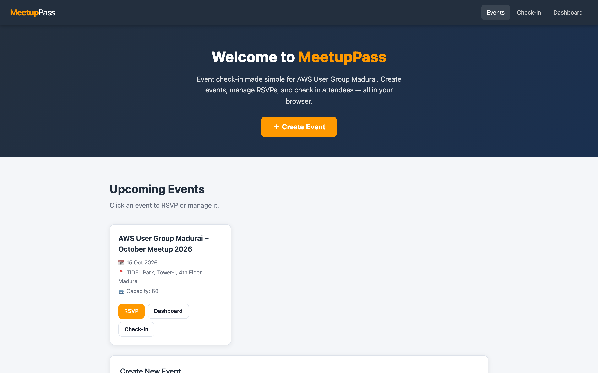
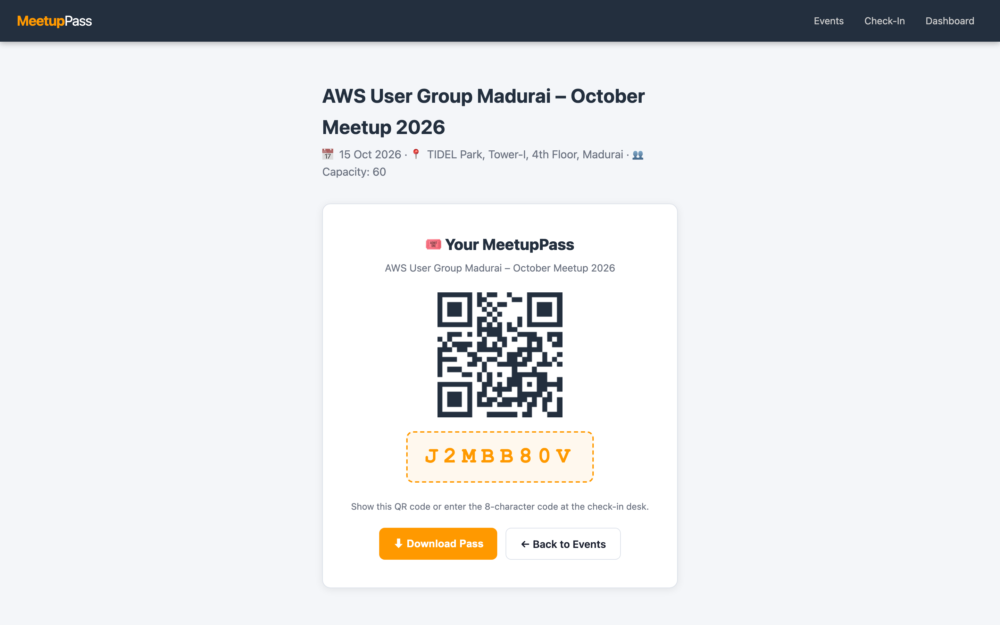
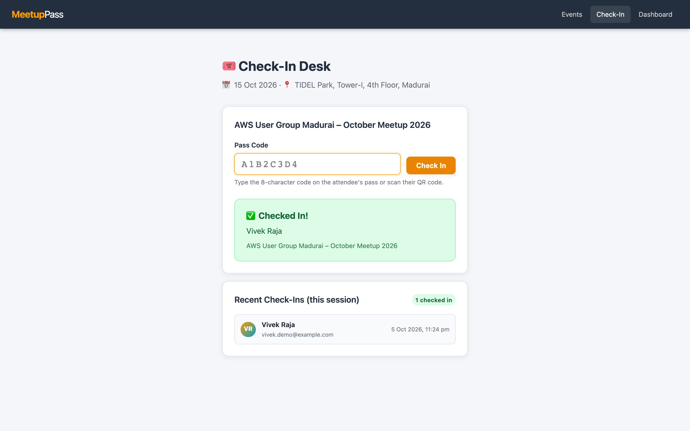
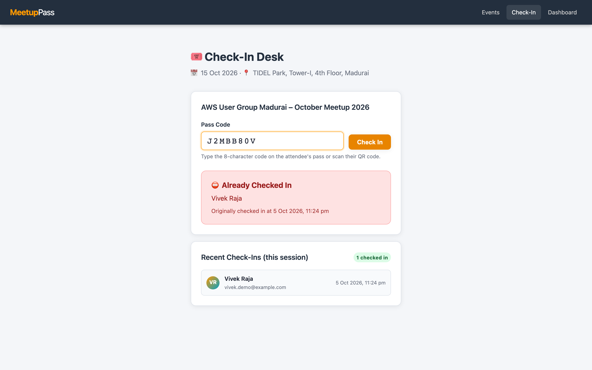
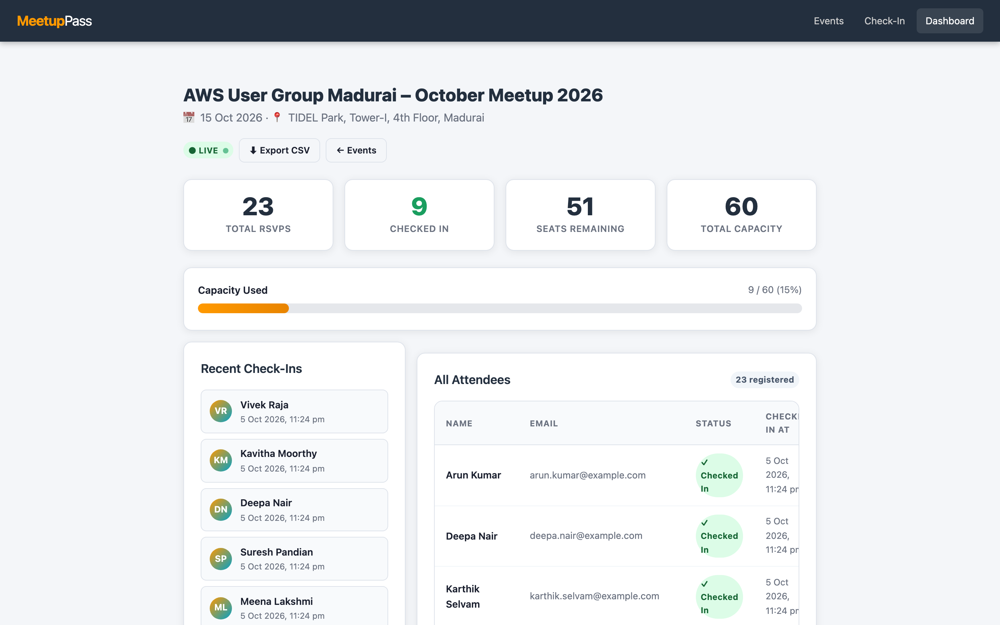

# MeetupPass 🎟

**Event check-in made simple — built for AWS User Group Madurai.**

MeetupPass is a lightweight, zero-dependency web app that replaces spreadsheets and manual attendance tracking for community meetups. Organizers create events, attendees RSVP and receive a unique QR-code pass, and check-in staff scan or type the code at the door.

> **Kiro University 2026 Final Project** — this repo demonstrates every major Kiro feature end-to-end.

---

## Screenshots

| Home — event list | RSVP pass + QR code |
|:-----------------:|:-------------------:|
|  |  |

| Check-in success | Duplicate check-in rejected | Live dashboard |
|:----------------:|:---------------------------:|:--------------:|
|  |  |  |

---

## Quick Start

```bash
# Prerequisites: Node.js 20+
git clone <repo-url>
cd kiro-uni-project
npm install          # installs fast-check dev dependency; zero runtime deps
npm run seed         # creates data/events.json + data/attendees.json with demo data
npm start            # → http://localhost:3000
npm test             # runs 22 tests (16 API + 6 property-based) with node:test
```

**Pages:**

| URL | Description |
|-----|-------------|
| `http://localhost:3000/` | Event list + create-event form |
| `http://localhost:3000/rsvp.html?eventId=<id>` | Attendee RSVP + QR pass |
| `http://localhost:3000/checkin.html?eventId=<id>` | Check-in desk |
| `http://localhost:3000/dashboard.html?eventId=<id>` | Live dashboard + CSV export |

---

## API Reference

| Method | Path | Description | Request Body | Response |
|--------|------|-------------|--------------|----------|
| `GET`  | `/api/events` | List all events | — | `Event[]` 200 |
| `POST` | `/api/events` | Create an event | `{ name, date, venue, capacity }` | `Event` 201 |
| `GET`  | `/api/events/:id` | Get single event | — | `Event` 200 |
| `POST` | `/api/rsvp` | RSVP for an event | `{ eventId, name, email }` | `{ passCode, attendeeId }` 201 |
| `POST` | `/api/checkin` | Check in an attendee | `{ passCode }` | `{ success, attendee }` 200 |
| `GET`  | `/api/dashboard/:eventId` | Live stats | — | `{ event, totalRsvp, totalCheckedIn, remaining, recentCheckIns }` 200 |
| `GET`  | `/api/export/:eventId` | Download CSV | — | `text/csv` 200 |

**Error shape:** all errors return `{ "error": "<message>" }` with the appropriate HTTP status code (400, 404, 409, 500).

---

## Data Model

### Event
```json
{
  "id": "evt_abc123",
  "name": "AWS User Group Madurai – October Meetup 2026",
  "date": "2026-10-15",
  "venue": "TIDEL Park, Madurai",
  "capacity": 60,
  "createdAt": "2026-10-01T10:00:00.000Z"
}
```

### Attendee
```json
{
  "id": "att_xyz789",
  "eventId": "evt_abc123",
  "name": "Arun Kumar",
  "email": "arun@example.com",
  "passCode": "P3K9WXMQ",
  "rsvpAt": "2026-10-10T14:22:00.000Z",
  "checkedIn": false,
  "checkedInAt": null
}
```

---

## Stack

- **Runtime:** Node.js 20+ — zero npm runtime dependencies
- **Server:** `node:http` — no Express
- **Persistence:** `node:fs/promises` — JSON files in `./data/`
- **Pass codes:** `node:crypto` — `randomBytes(6).toString('base64url')`
- **QR codes:** [qrcode.js](https://github.com/davidshimjs/qrcodejs) via CDN (client-side only)
- **Frontend:** Vanilla HTML5 / CSS3 / ES modules — no framework, no bundler
- **Tests:** `node:test` + `node:assert/strict` + `fast-check` (property-based, dev only)

---

## Built with Kiro

This project was built using **[Kiro](https://kiro.dev)** — an AI-assisted development environment — and deliberately exercises every major Kiro feature. Here's exactly how each feature was used:

### 1. Steering Documents
*Persistent instructions that Kiro reads automatically on every interaction.*

| File | Purpose |
|------|---------|
| `.kiro/steering/product.md` | Defines the vision, target users, value propositions, and non-goals — keeps Kiro focused on the right problem |
| `.kiro/steering/tech.md` | Mandates Node.js 20+ built-ins, no Express, `node:http`, JSON file persistence, CDN-only QR library |
| `.kiro/steering/structure.md` | Enforces directory layout, naming conventions, import order — every generated file matches the spec |
| `.kiro/steering/testing.md` | `inclusion: always` — Kiro always knows the testing philosophy: `node:test`, real HTTP server, ephemeral port, isolated temp data dir |

Kiro used these files to guide every code-generation decision without being re-explained each time.

### 2. Spec-Driven Development
*Structured specs (requirements → design → tasks) used as a north star for implementation.*

| File | Purpose |
|------|---------|
| `.kiro/specs/meetup-checkin/requirements.md` | EARS-format user stories (US-1.1 through US-5.1) with explicit acceptance criteria — Kiro cross-checked each endpoint against these ACs |
| `.kiro/specs/meetup-checkin/design.md` | Architecture overview, Mermaid sequence diagram, data model, full API table, and a **Correctness Properties** section defining six universal properties verified by property-based tests |
| `.kiro/specs/meetup-checkin/tasks.md` | Phase-by-phase implementation checklist — Kiro ticked items off as each file was completed |

The specs prevented scope creep and gave Kiro a concrete definition of "done".

### 3. Agent Hooks
*Automated actions triggered by file saves or git events.*

| File | Trigger | Action |
|------|---------|--------|
| `.kiro/hooks/test-on-save.json` | Any `src/*.js` file saved | Runs `npm test` immediately — regressions are caught before the developer moves on |
| `.kiro/hooks/readme-sync.json` | `src/routes.js` saved | Prompts Kiro to update the API Reference table in `README.md` to stay in sync |
| `.kiro/hooks/secret-scan.json` | Pre-git-commit | Greps staged files for hardcoded API keys, passwords, and tokens — warns if any are found |

These hooks demonstrate Kiro's ability to enforce team conventions automatically.

### 4. MCP (Model Context Protocol)
*External tools connected directly into Kiro's context.*

| File | Server | Use |
|------|--------|-----|
| `.kiro/settings/mcp.json` | `awslabs.aws-documentation-mcp-server@latest` (via `uvx`) | Lets Kiro search official AWS docs in-context — ready for the next step of deploying MeetupPass to AWS |
| `.kiro/settings/mcp.json` | `mcp-server-fetch` (via `uvx`) | Lets Kiro read any public URL (library docs, CDN pages) without leaving the editor |

The reviewer agent also has its own **agent-scoped** copy of the AWS documentation MCP server — see section 5 below.

MCP lets Kiro consult live documentation instead of relying on potentially stale training data.

### 5. Custom Agent
*A purpose-built agent with domain-specific review instructions, scoped MCP access, and startup hooks.*

| File | Role |
|------|------|
| `.kiro/agents/reviewer.json` | **Reviewer agent** — a senior Node.js engineer persona that reviews changes against the tech steering, spec ACs, API contract, test coverage, property-based correctness properties, and a security checklist, returning `APPROVED / NEEDS CHANGES / BLOCKED` with file:line comments. Run with `kiro-cli chat --agent reviewer`. |

The reviewer agent is configured with three advanced features:

**Agent-scoped MCP server:** `reviewer.json` declares its own `mcpServers` entry for `awslabs.aws-documentation-mcp-server@latest`. This means the reviewer can call `@aws-documentation` tools (search, read, fetch sections) to look up AWS SDK usage, IAM policy syntax, and service best practices inline during a review — without requiring a workspace-level MCP connection.

**Pre-approved read-only MCP tools:** The `allowedTools` list includes `@aws-documentation/search_documentation`, `@aws-documentation/read_documentation`, and `@aws-documentation/read_sections` so the reviewer can use these tools without prompting for approval on every call.

**agentSpawn hooks:** When the reviewer agent starts, two commands run automatically to prime its context:
- `git status --short` — shows which files have been modified since the last commit
- `npm test --silent 2>&1 | tail -6` — runs the full test suite and surfaces the pass/fail summary so the reviewer immediately knows the current test health

### 6. Property-Based Testing (fast-check)
*Universal correctness properties verified across hundreds of random inputs.*

The `test/properties.test.js` file uses **[fast-check](https://fast-check.dev)** (installed as a devDependency) alongside the standard `node:test` runner to verify six properties defined in `.kiro/specs/meetup-checkin/design.md § Correctness Properties`. Each property runs with `numRuns: 100`, using the same temp-dir isolation pattern as `test/api.test.js`.

| Property | What it verifies |
|----------|-----------------|
| **P1 — Pass code format + uniqueness** | All pass codes match `/^[A-Z0-9]{8}$/` and are pairwise distinct across any set of RSVPs |
| **P2 — RSVP → Check-In round trip** | After check-in, exactly the right attendee is marked `checkedIn: true`; no other attendee changes |
| **P3 — Check-in idempotency** | A second check-in with the same code always returns 409; `checkedInAt` is never overwritten |
| **P4 — Dashboard invariants** | `0 ≤ totalCheckedIn ≤ totalRsvp ≤ capacity` and `remaining = capacity − totalCheckedIn` for any combination of RSVPs and check-ins |
| **P5 — Unknown codes never change state** | Any unrecognised pass code returns 404 and leaves the attendee list byte-for-byte identical |
| **P6 — CSV round-trip fidelity** | The export has exactly one row per attendee and correctly RFC 4180-quotes names/emails that contain commas or double-quote characters |

The full test suite runs 22 tests: 16 API integration tests + 6 property tests.

```bash
npm test   # → 22 pass, 0 fail
```

fast-check found no bugs in this codebase — all six properties hold against the current implementation.

### 7. Powers (Kiro Extensions)
*Packaged skills and MCP configuration that can be shared and installed by anyone.*

**Installed power — power-builder:** The `power-builder` power (installed from the Kiro registry) provides skills for authoring new powers to the [Agent Plugins v1.0.0 specification](https://agent-plugins.org/). Its guidance was used to structure `powers/meetuppass-events/`.

**Packaged power — meetuppass-events:** This repo ships a ready-to-install Kiro power at `powers/meetuppass-events/` that packages the knowledge from this project so anyone can build or operate a community check-in app with Kiro's help.

```bash
kiro-cli powers install ./powers/meetuppass-events
```

The power contains:

| File | Purpose |
|------|---------|
| `plugin.json` | Agent Plugins v1.0.0 manifest — name, keywords, author, schema ref |
| `mcp.json` | Bundles `mcp-server-fetch` so the agent can read CDN/library docs inline |
| `skills/build-meetup-checkin-app/SKILL.md` | Step-by-step guide: persistence layer, route handlers, frontend, tests, steering docs |
| `skills/build-meetup-checkin-app/references/steering-templates.md` | Copy-paste-ready `.kiro/steering/` starter files |
| `skills/run-meetup-checkin-app/SKILL.md` | Operations guide: start, seed, test, export CSV, event-day checklist, troubleshooting |

### 8. Vibe / Chat Mode
The whole build was driven from a single natural-language prompt in `kiro-cli chat`: Kiro turned it into steering docs, a spec and a task list, then implemented the tasks. When the first session was throttled mid-build, `kiro-cli chat --resume` picked up the same conversation and finished the remaining tasks.

### 9. Autopilot / Autonomous Mode
Kiro autonomously:
- Read all existing files before writing any new code
- Created `public/checkin.html`, `public/dashboard.html`, `scripts/seed.js`, `test/api.test.js`, and `README.md` without step-by-step prompting
- Ran `npm run seed` and `npm test` and verified the server responds before finishing
- Marked each task in `tasks.md` as `[x]` as it was completed

---

## Project Structure

```
meetuppass/
├── .kiro/
│   ├── steering/               # product.md · tech.md · structure.md · testing.md
│   ├── specs/meetup-checkin/   # requirements.md · design.md (+ Correctness Properties) · tasks.md
│   ├── hooks/                  # test-on-save · readme-sync · secret-scan
│   ├── settings/mcp.json       # workspace-level AWS docs + fetch MCP servers
│   └── agents/reviewer.json    # reviewer agent with scoped MCP + agentSpawn hooks
├── src/
│   ├── server.js               # node:http entry point
│   ├── routes.js               # API route handlers + static file serving
│   └── db.js                   # JSON file persistence layer
├── public/
│   ├── index.html              # Event list + create form
│   ├── rsvp.html               # RSVP form + QR pass
│   ├── checkin.html            # Check-in desk
│   ├── dashboard.html          # Live dashboard + CSV export
│   ├── style.css               # Shared styles (CSS custom properties)
│   └── app.js                  # Shared client utilities
├── powers/
│   └── meetuppass-events/      # Installable Kiro power (Agent Plugins v1.0.0)
│       ├── plugin.json
│       ├── mcp.json
│       ├── skills/
│       │   ├── build-meetup-checkin-app/SKILL.md
│       │   └── run-meetup-checkin-app/SKILL.md
│       └── README.md
├── docs/
│   └── screenshots/            # home · rsvp-pass · checkin-success · checkin-duplicate · dashboard
├── scripts/seed.js             # Demo event + 22 attendees, ~1/3 checked in
├── test/
│   ├── api.test.js             # 16 node:test integration tests
│   └── properties.test.js      # 6 fast-check property tests (100 runs each)
├── data/.gitkeep               # JSON files ignored; directory kept in git
└── package.json                # type: module; devDeps: fast-check; scripts: start, seed, test
```

---

## License

MIT — AWS User Group Madurai
